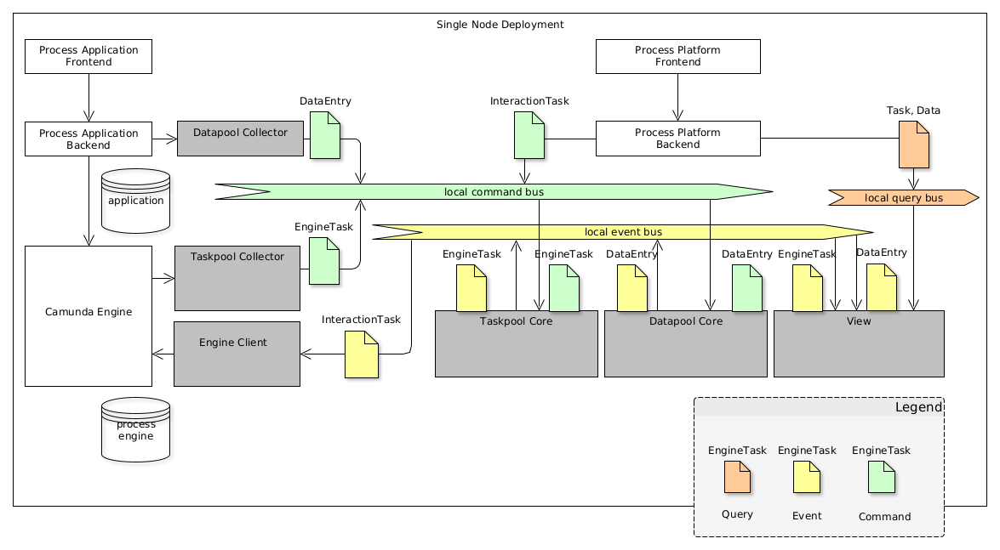
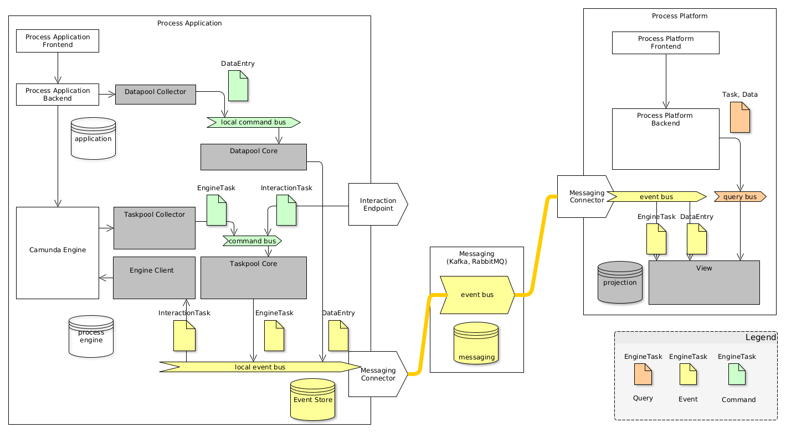
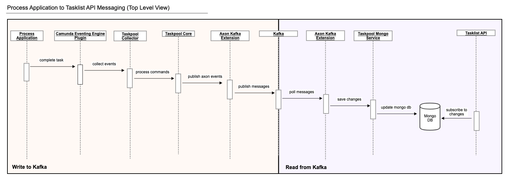
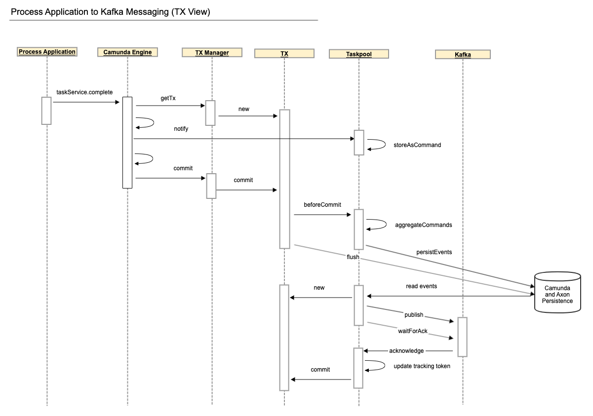

Depending on your requirements and infrastructure available several deployment scenarios of the components are possible.

The simplest setup is to run all components on a single node. A more advanced scenario is to distribute components over the network and connect them.

In doing so, one of the challenging issues for distribution and connecting microservices is a setup of messaging technology
supporting required message exchange patterns (MEPs) for a CQRS system. Because of different semantics of commands,
events and queries and additional requirements of event-sourced persistence a special implementation of
command bus, event bus and event store is required. In particular, two scenarios can be distinguished: using Axon Server
or using a different distribution technology.

## Single node deployment

The easiest scenario is the **Single Node Deployment**. It provides all functional features of the Polyflow library, but is not not addressing any of performance, scalability, autonomy and reliability requirements. It works almost without additional infrastructure and is ideal to start with.

In a single node scenario the following configuration is used:

* All buses are local (command bus, event bus, query bus)
* Camunda BPM Integration components, Core components and View components are all deployed in the same node
* JPA-Based event storage is used, persisting the domain events in a RDBMS, along with Camunda-specific DB tables.
* Simple (In-memory) View is used to provide projections of `taskpool` and `datapool`

Check the following diagram for more details:

## Multiple node deployment

The more advanced scenario is to separate the **Process Platform components** from **Process Application components**.

It is helpful if you intend to build a central **Process Platform** and multiple **Process applications** using it.

In general, this is the main use case for Polyflow framework itself, but the distribution aspects adds technical complexity to the resulting architecture. Especially, following the architecture blueprint of Axon Framework, the three buses (command bus, event bus and query bus) needs to be distributed and act as connecting infrastructure between components.

### Distribution using Axon Server

Axon Server provides an implementation for this requirement leading to a distributed buses and a central Event Store. It is easy to use, easy to configure and easy to run. If you need a HA setup, you will need the enterprise license of Axon Server. Essentially, if don't have another HA ready-to use messaging, this scenario might be your way to go.

This scenario supports:

-  central Process Platform components (including task pool and data pool)
-  free choice for projection persistence (since Axon Server supports)
-  no direct synchronous communication between **Process Platform** and **Process Application** is required (e.g. via REST, since it is routed via command bus)

The following diagram depicts the distribution of the components and the messaging:

### Distribution without Axon Server

If you already have another messaging at place, like Kafka or RabbitMQ, you might skip the usage of Axon Server. In doing so, you will be responsible for distribution of events and will need to surrender some features.

This scenario supports:

-  distributed task pool / data pool
-  view **MUST** be persistent (no replay supported)
-  direct communication between task list / engines required (addressing, routing)
-  concurrent access to engines might become a problem (no unit of work guarantees)

The following diagram depicts the distribution of the components and the messaging.

The following diagram depicts the task run from Process Application to the end user, consuming it via Tasklist API.

- The `Camunda BPM Taskpool Collector` component listens to Camunda events, collects all relevant events that happen in a single transaction and registers a transaction synchronization to process them beforeCommit. Just before the transaction is committed, the collected events are accumulated and sent as Axon Commands through the `CommandGateway`.
- The `Taskpool Core` processes those commands and issues Axon Events through the EventGateway which are stored in Axon's database tables within the same transaction.
- The transaction commit finishes. If anything goes wrong before this point, the transaction rolls back and it is as though nothing ever happened.
- In the `Axon Kafka Extension`, a `TrackingEventProcessor` polls for events and sees them as soon as the transaction that created them is committed. It sends each event to Kafka and waits for an acknowledgment from Kafka. If sending fails or times out, the event processor goes into error mode and retries until it succeeds. This can lead to events being published to Kafka more than once but guarantees at-least-once delivery.
- Within the Tasklist API, the `Axon Kafka Extension` polls the events from Kafka and another TrackingEventProcessor forwards them to the `TaskPoolMongoService` where they are processed to update the Mongo DB accordingly.
- When a user queries the Tasklist API for tasks, two things happen: Firstly, the Mongo DB is queried for the current state of tasks for this user and these tasks are returned. Secondly, the Tasklist API subscribes to any changes to the Mongo DB. These changes are filtered for relevance to the user and relevant changes are returned after the current state as an infinite stream until the request is cancelled or interrupted for some reason.

#### From Process Application to Kafka

#### From Kafka to Tasklist API

