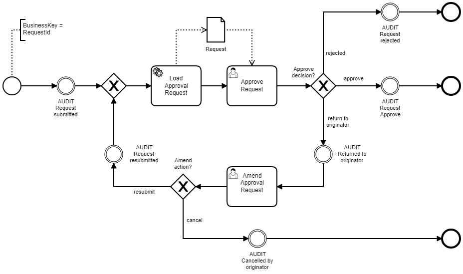

# Sample Approval Application

The following application is an example demonstrating the usage of the Camunda BPM Taskpool. The application is 
build as a SpringBoot process application and shows a simple approval process.

## Usage 

The application consists of two Maven modules:
 * h2 (external database)
 * process-application (example application)
 
Both modules can be build using Maven by running `mvn clean install` from the commandOrUpdate line. Then both modules
can be started by running `mvn spring-boot:run` from commandOrUpdate line. 

The example application provides a REST API for interaction and offers the Swagger UI for easier usage. 
After starting the application, simply open [http://localhost:8080/swagger-ui.html](http://localhost:8080/swagger-ui.html)
in browser of your choice. 

## Storyboard

The following storyboard can be used to understand the Camunda BPM Taskpool mechanics. The following sample
approval process has been implemented:

1. Send a request with data about new request, which needs to be approved. For doing so, send a POST request to the 
`request-controller` (`POST http://localhost:8080/request`). This call creates a dummy request, for 
salary increase (by kermit for piggy for 10000 USD), which is stored in a artificial "legacy" application. 
As a result you will receive the id of the request, acting as a business key of the started process instance:

          AR-c023fafc-ac57-4d31-802d-be718f4aff50

2. The approval process will create a user task `Approve Request` which can be either approved, rejected or returned 
to the originator and will assign it to some users. In order to see the list of available user tasks, send a GET 
request to the `task-controller` by providing a username (`GET http://localhost:8080/tasks?username=gonzo`) and 
you will receive a list of tasks with all supplied information available in the task pool:

        [
          {
            "id": "19",
            "sourceReference": {
              "instanceId": "5",
              "executionId": "17",
              "definitionId": "process_approve_request:1:4",
              "definitionKey": "process_approve_request"
            },
            "taskDefinitionKey": "user_approve_request",
            "payload": {
              "request": "AR-c023fafc-ac57-4d31-802d-be718f4aff50",
              "amount": 10000,
              "subject": "Salary increase",
              "currency": "USD",
              "applicant": "piggy"
            },
            "correlations": {
              "io.holunda.camunda.taskpool.example.ApprovalRequest": "AR-c023fafc-ac57-4d31-802d-be718f4aff50"
            },
            "businessKey": "AR-c023fafc-ac57-4d31-802d-be718f4aff50",
            "enriched": true,
            "name": "Approve Request",
            "description": "Please approve request AR-c023fafc-ac57-4d31-802d-be718f4aff50 from kermit on behalf of piggy",
            "formKey": "approve-request",
            "priority": 23,
            "createTime": "2018-10-11T12:19:27.871+0000",
            "candidateUsers": [
              "fozzy",
              "gonzo"
            ],
            "candidateGroups": [
              "muppetshow"
            ],
            "assignee": null,
            "owner": null,
            "dueDate": "2019-06-26T07:55:00.000+0000"
          }
        ]

3. Let's assume the salary increase request is too high and we want to inform kermit about this. We are not rejecting the 
request completely, but return it to back to kermit with the comment, that this year, the salary increase limit is 7500 USD.
To do so send your decision to the `process-controller` by providing the business key, the decision and the comment
 (`POST http://localhost/request/AR-c023fafc-ac57-4d31-802d-be718f4aff50/decision/RETURN`). The process will create
a new user task `Amend Request` for the originator, who is kermit.

4. Kermit will change the amount of the request in the "legacy" application and re-submit the request. For doing so, let's 
first receive the request from the `request-controller` (`GET http://localhost/request/AR-c023fafc-ac57-4d31-802d-be718f4aff50`) 
and then send the modified request back (`POST http://localhost/request/AR-c023fafc-ac57-4d31-802d-be718f4aff50`) containing the updated data
structure as payload.

        {
          "id": "AR-c023fafc-ac57-4d31-802d-be718f4aff50",
          "originator": "kermit",
          "applicant": "piggy",
          "subject": "Salary increase",
          "amount": 75000,
          "currency": "USD"
        }

5. Now, after the request is changed, we just resubmit it by sending the following request to the `process-controller`: 
(`POST http://localhost/request/AR-6a42e1d8-23ab-4242-b310-7bbbeb7fe15c/action/RESUBMIT`)

6. Again, let's retrieve the tasks from the task pool: (`GET http://localhost:8080/tasks?username=gonzo`) and this time 
approve the salary increase (`POST http://localhost/request/AR-c023fafc-ac57-4d31-802d-be718f4aff50/decision/APPROVE`).

        [
          {
            "id": "38",
            "sourceReference": {
              "instanceId": "5",
              "executionId": "36",
              "definitionId": "process_approve_request:1:4",
              "definitionKey": "process_approve_request"
            },
            "taskDefinitionKey": "user_approve_request",
            "payload": {
              "request": "AR-c023fafc-ac57-4d31-802d-be718f4aff50",
              "amount": 75000,
              "subject": "Salary increase",
              "currency": "USD",
              "applicant": "piggy"
            },
            "correlations": {
              "io.holunda.camunda.taskpool.example.ApprovalRequest": "AR-c023fafc-ac57-4d31-802d-be718f4aff50"
            },
            "businessKey": "AR-c023fafc-ac57-4d31-802d-be718f4aff50",
            "enriched": true,
            "name": "Approve Request",
            "description": "Please approve request AR-c023fafc-ac57-4d31-802d-be718f4aff50 from kermit on behalf of piggy",
            "formKey": "approve-request",
            "priority": 23,
            "createTime": "2018-10-11T12:29:33.040+0000",
            "candidateUsers": [
              "fozzy",
              "gonzo"
            ],
            "candidateGroups": [
              "muppetshow"
            ],
            "assignee": null,
            "owner": null,
            "dueDate": "2019-06-26T07:55:00.000+0000"
          }
        ]

## REST API

<table>
<tr>
  <th>URL</th><th>HTTP Method</th><th>Body</th><th>Response</th><th>Purpose</th>
</tr>
<tr>
  <td>/request</td><td>POST</td><td>-</td><td>Request id</td><td>Creates a new dummy request, stores it in 
  the legacy application and starts the approval process.</td>
</tr>
<tr>
  <td>/request/{id}</td><td>GET</td><td>-</td><td>Request</td><td>Retrieves the request by id.</td>
</tr>
<tr>
  <td>/request/{id}</td><td>POST</td><td>Request</td><td>-</td><td>Changes the request by id.</td>
</tr>
<tr>
  <td>/tasks?username={username}</td><td>GET</td><td>-</td><td>List of tasks</td><td>JSON describing tasks available for user specified by {username}</td>
</tr>
<tr>
  <td>/request/{id}/decision/{DECISION}</td><td>POST</td><td>Comment</td><td>-</td><td>Completes "Approve Request" task for request with id {id} with the decision {DECISION}, where
  decision should be one of:
  <ul><li>APPROVE: approve request.</li><li>REJECT: reject the request.</li><li>RETURN: return to originator.</li></ul></td>
</tr>
<tr>
  <td>/request/{id}/action/{ACTION}</td><td>POST</td><td>-</td><td>-</td><td>Completes "Amend Request" task for request with id {id} with the action {ACTION}, where
  action should be one of:
  <ul><li>CANCEL: cancels the request.</li><li>RESUBMIT: re-submits the request.</li></ul></td>
</tr>

</table>
